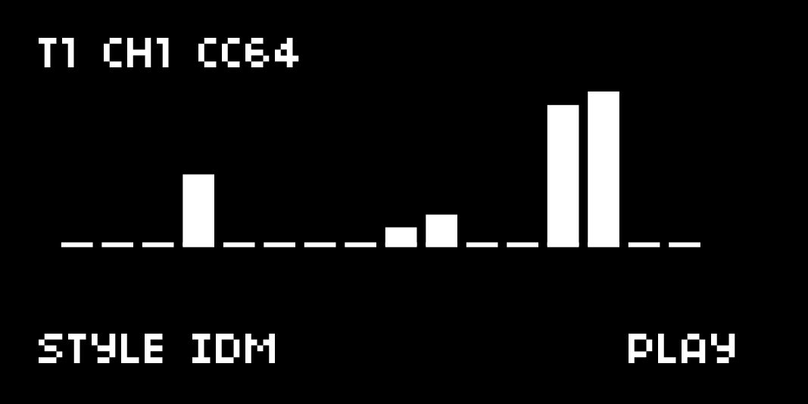

# **MDBass**

**Machinedrum Bass Generator** turns an Elektron Machinedrum track into a dedicated melodic bassline and tonal synthesizer for **monome norns**.  
Designed around the unofficial Machinedrum **OS "X"** tonal pitch system, every note step automatically transmits a scale-quantized CC to Synth Parameter 1 (`PTCH`) paired with a trigger note.

**Author:** HANJO – Tokyo, Japan 🇯🇵



---

## **COMMUNITY & DISCUSSIONS**

- **Lines Forum Thread:** [Machinedrum Bass Generator](https://llllllll.co/t/machinedrum-bass-generator/75512)

---

## **FEATURES**

- **`E1`**: Select target Machinedrum track (1–16)
- **`E2`**: Select parameter
- **`E3`**: Change parameter value
- **`K2`**: Play / Stop
- **`K3`**: Regenerate bassline

### **Shift Functions (Hold `K1`)**
- **`K1` + `K2`**: Audition root + octave (use to calibrate pitch/tuning)
- **`K1` + `K3`**: Mutate current pattern once
- **`K1` + `E2`**: Select step / preview pitch CC

---

## **MACHINEDRUM SETUP & CALIBRATION**

1. **Kit Setup:** On your target MD track, choose a machine with pitch controls (e.g., `GND-SN`, `TRX-B2`) and set its tonality to **TONAL** (`EDIT KIT > TUNING`).
2. **MIDI Base Channel:** Set the Machinedrum base channel to match the `MD base channel` param (default is `1`). Track $t$ listens for CC on `base + (t - 1) // 4`.
3. **Calibrate:**
   - Hold **`K1` + `K2`** to audition the root note and the octave above.
   - Adjust **`tune: CC @ C2`** until the root pitch is in tune.
   - Adjust **`CC steps per semitone`** (`1` or `2`) until the upper note lands cleanly one octave up.

---

## **RECORD MODE (`E2 > MODE > REC`)**

Captures a clean, un-randomized 16-step take straight into the Machinedrum sequencer:
- Press **`K2`** to run **ONE clean 16-step take**.
- Emits an optional rec-arm note, bar-aligned MIDI START, count-in bar(s), 16 steps, and MIDI STOP.
- Temporarily bypasses `PROB%` and `EVOLVE%` during recording for a faithful print.
- **Prerequisites:** 
  - MD: external clock + transport receive enabled.
  - norns: set `CLOCK > MIDI clock out` to the MD.
  - Select an empty 16-step pattern on the MD and arm REC (manually or via note mapped in `MAP EDITOR > CTRL`).

---

## **OUTPUTS**

- Sends coordinated **MIDI CC** (Synth Param 1 / `PTCH`) and **Note Trigger** messages over USB/MIDI.
- Target MD track and MIDI base channel fully configurable.

---

## **REQUIREMENTS**

- **monome norns** (any model)
- **Elektron Machinedrum** (running unofficial **OS "X"** with tonal pitch enabled)
- USB-MIDI interface or direct MIDI connection between norns and Machinedrum

---

## **INSTALLATION**

Install via Maiden:
```bash
;install [https://github.com/hanjo-synth/MDBass](https://github.com/hanjo-synth/MDBass)
